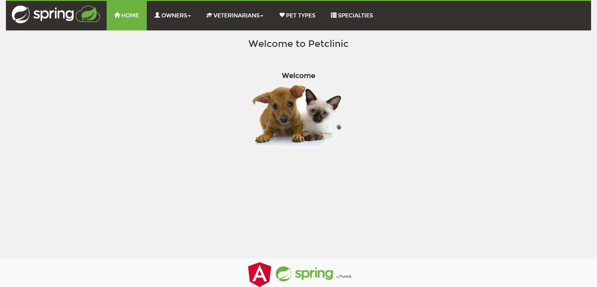

# Laboratorium 1

## Instrukcja:
    1. Podłączenie się do Azure.
    2. Wybranie konfiguracji.
    3. Wywołanie `./deploy.sh config_*.json`
    - Numer wybranej konfiguracji

## Konfiguracja 1.
### Wywołanie
    Komenda: `./deploy.sh config_1.json`
    Instalacja przebiegła bez problemów.

### Próba połączenia
    Instalacja stworzyła maszyny i przydzieliła im adresy IP.

#### FrontEnd
    Po wejściu na adres IP z odpowiednim portem wita nas strona początkowa. Frontend działa!

    Następnie przechodzę na podstronę, aby przetestować połączenie z backendem, i również działa.

#### Backend
    Następnie wchodzę na adres serwera backendowego: http://40.118.6.191:8080/petclinic/api/owners
    API działa poprawnie i odpowiada na zapytania.

#### Bazy Danych
    Bazy danych nie mają zewnętrznego API, więc nie można się do nich dołączyć.

### Test
    Dodanie nowego właściciela:

    Dodanie przebiegło poprawnie.

## Konfiguracja 2.
    Jest to konfiguracja z NGINXem w roli loadbalancera z trzema backendami.

### Wywołanie:
    Komenda: `./deploy.sh config_2.json`

    Deploy przebiegł pomyślnie - utworzono grupę zasobów o nazwie wus_1_2.

#### FrontEnd:
    Przechodzimy na adres `<ip/port>` frontendu.

    Udało się połączyć z frontendem!

#### Backend:
    Ze względu na konfigurację sieciową (tj. dostępność tylko i wyłącznie elementów wymaganych), nie ma możliwości weryfikacji architektury wewnętrznej za pomocą reverse-proxy (NGINXem).

#### Test bazy danych i działania backendu:
    Dodanie nowego typu zwierzaka:

    Pomyślnie dodano szczura.

## Konfiguracja 5.