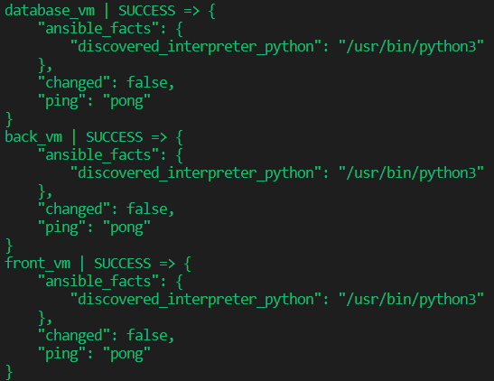
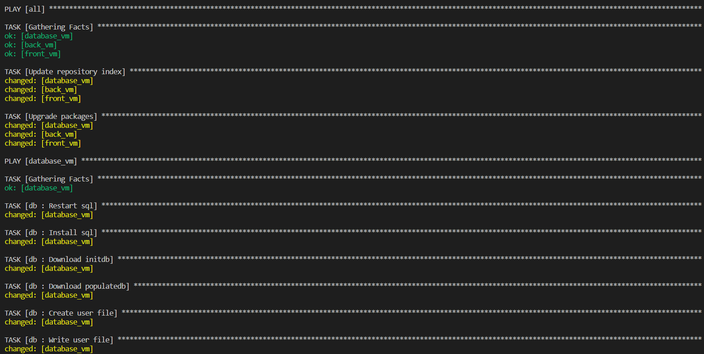
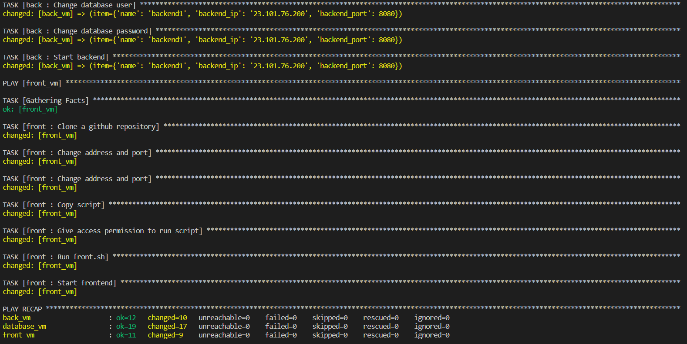
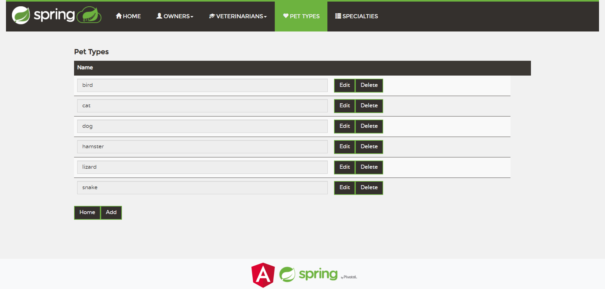
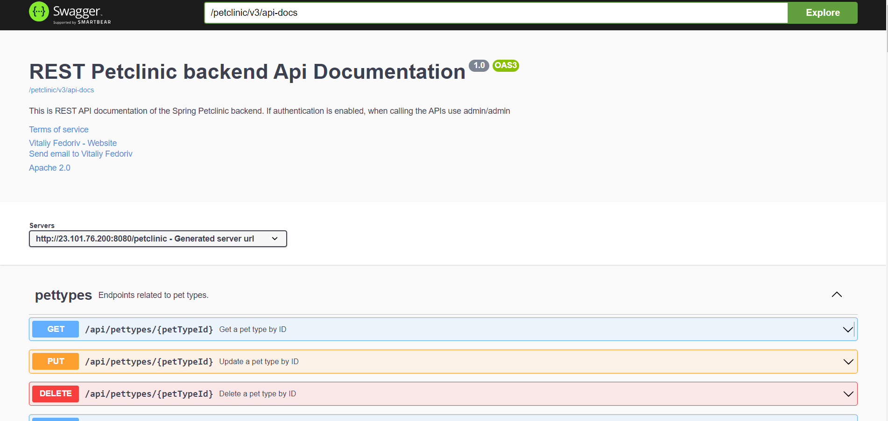
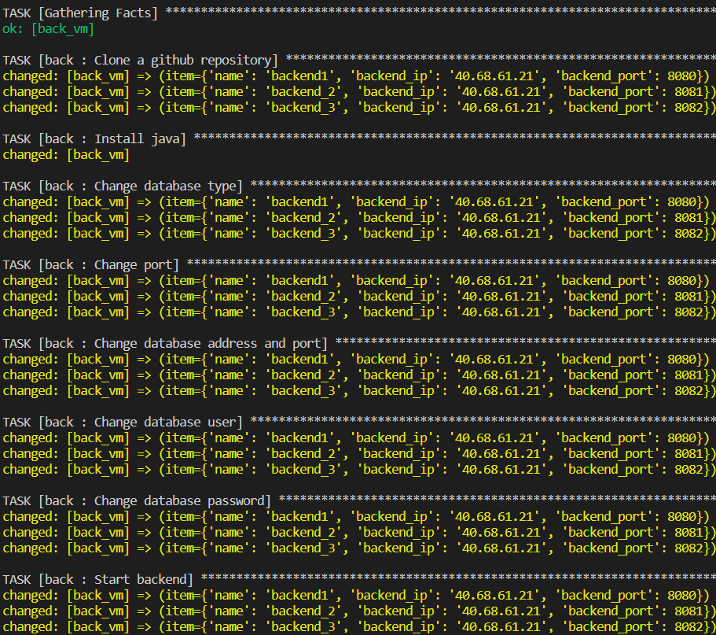
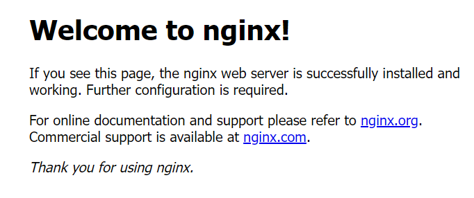

Na początku tworzymy maszyny za pomocą skryptu: ```./deploy.sh config.json```. Skrypt oprócz tworzenia maszyn uzupełnia plik inventory.yaml oraz folder /vars.

Następnie sprawdza czy ansible może nawiązać połączenie z maszynami za pomocą komendy: ```ansible -i inventory.yaml all -m ping```



Aby uruchomić poszególne konfiguracje należy mieć zainstalowany ansible, a następnie wywołać komendę:
``` ansible-playbook playbookN.yaml -i inventory.yaml```
,gdzie N to numer konfiguracji

## 1
``` ansible-playbook playbook1.yaml -i inventory.yaml```




Po zakończeniu skryptu można przejść do stron frontendu oraz backendu. Adresy ip znajdują się w pliku inventory.yaml

Adres frontendu: {front_ip}:8080

Adres backendu: {back_ip}:8080/petclinic


## 2
``` ansible-playbook playbook1.yaml -i inventory.yaml```
W 2 konfiguracji właczamy wykonywanie skryptu dla backendu w pętli na maszynie backend_VM.


Uzyskujemy połącznie przez nginx.




## 5
``` ansible-playbook playbook5.yaml -i inventory.yaml```